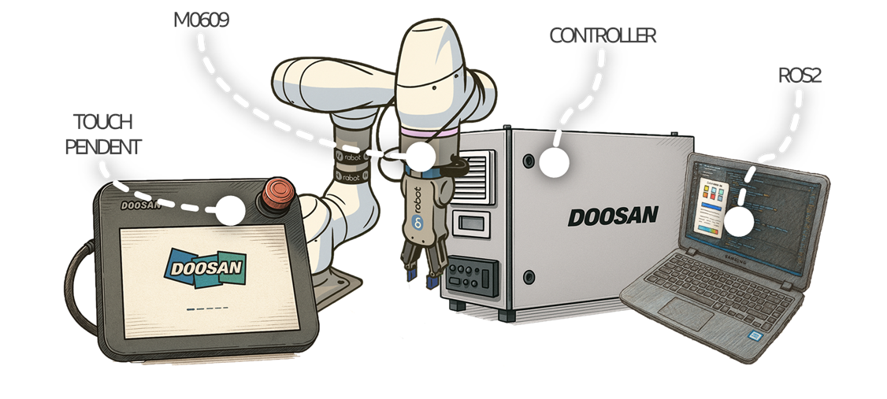
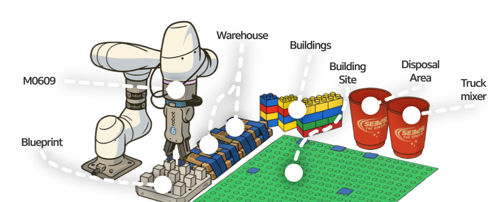

  
  
  

# LoBotHouse (Implementation of a Robotic Automation Process System Using ROS2)  

**A collaborative robot (cobot) for construction that supports labor-intensive tasks and mitigates high accident risks on site** **from Doosan Robotics Rokey Bootcamp3 in 2025**

---

## 🗂️ Overview
This project utilizes the Doosan collaborative robot M0609 to symbolically implement and prototype key construction functions commissioned by government or enterprise clients. The robot interprets architectural blueprints, performs construction tasks accordingly, and detects defective materials, offering a proof-of-concept system for automated building assistance.

---

## 🛠️ Equipment and Materials Used

- Doosan Collaborative Robot M0609  
- ROS2 Humble + Ubuntu 22.04

---
## Assumptions for Scenario

1. There are multiple robots in real-world scenarios; however, only the M0609 is considered in this project.
2. Due to constraints, the steel bar plate is used to represent the blueprint.
3. Warehouses are built in sourcing areas, and all materials are classified by workers; therefore, misclassifications may occur.
4. There are three types of buildings.
5. The disposal area and truck mixer are represented by cups.
6. The building site is assumed to be a LEGO base.
---

## Scenario
1. The M0609 transports construction materials for foundation work and carries out concrete pouring.
2. The robot interprets the blueprint by measuring the height of steel bars embedded in the plate, saving information about the building type and its position.
3. Based on the interpreted data, the robot stacks LEGO blocks to build the structure.
- If the gripper detects an abnormal object, the robot moves it to the disposal area.
- Even if the robot stops due to an error or emergency, it can resume operation using system variables.

